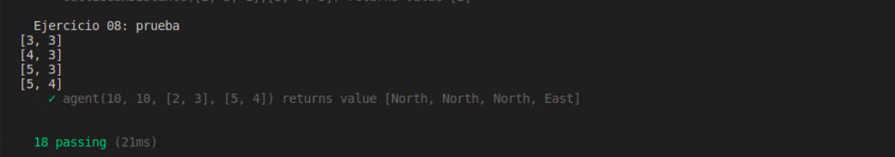

# Práctica 4 - Arrays, tuplas y enumerados

```
Universidad: Universidad de La laguna
Asignatura: Desarrollo de Sistemas Informaticos
Curso: 2020 - 2021
Autor: XueMei Lin
```

## 1. Introducción

Arrays, tuplas, y enumerados es una de las partes que debemos aprender en lenguaje TypeScript. Además, en esta práctica vamos a introducir el uso de [TypeDoc](https://typedoc.org/) que sirve para convertir los comentarios en el código fuente de TypeScript en documentación HTML renderizada o un modelo JSON. Y por otro lado el funcionamiento de [Mocha](https://mochajs.org/) y [Chai](https://www.chaijs.com/).

## 2. Objetivos

Como hemos mencionado antes, vamos a utilizar arrays, tuplas y enumerados para realizar uan serie de ejercicios de programación en TypeScript y además usamos TypeDoc para general una documentación HTML. Asimismo, Usaremos Mocha y Chai para hacer las comprobaciones de funciones.

## 3. Ejercicios realizados

### 3.1. Ejercicio 1 - Decodificar resistencias

Si realizamos algún proyecto usando una Raspberry Pi, probablemente necesitaremos usar resistencias. Por lo tanto en este ejercicios vamos a hacer la codificación. El ejercicio consiste en codificar las bandas de colores a numero. Tal que:

> - Negro: 0
> - Marrón: 1
> - Rojo: 2
> - Naranja: 3
> - Amarillo: 4
> - Verde: 5
> - Azul: 6
> - Violeta: 7
> - Gris: 8
> - Blanco: 9

La salida debería ser la combinación de dos números que representan los colores. 

**Por ejemplo: (Negro y marrón) 
La salida será: 01**

En la implementación la función `decodeResistor` pasé un array de tipo string[] como parámetro y recorre dicho array para encontrar el valor correspondiente de cada color, eso si, aunque la función recibe más parámetro de color, solo devuelve el resultado con 2 dígitos.

**Resultado de ejecutar el ejercicio-1.js**


### 3.2 Ejercicio 2 - Palabras encadenas en un array

En este ejercicio lo que queremos conseguir es: dado un array que contiene exclusivamente cadenas de texto, comprobar que las palabras del array están encadenadas. Es decir, una o más letras del final de una cadena coinciden con el comienzo de la siguiente cadena del array.

En la implementación de la función `meshArray` lo que hace recorrer el array dado, comparar la letra que esta en la i posición del array,  encuentra letras iguales, guarda en el resultado, en el caso contrario, devuelve un -1;

**Resultado de ejecutar el ejercicio-2.js**


### 3.3 Ejercicio 3 - Calcular la media y concatenar cadenas

Dado un array, tal que dicho array contiene una serie de números y letras, la función `meanAndConcatenate` devolverá el resultado como un array con dos valores:

> - La media de los valores numéricos que encuentra en el array
> - Una cadena resultado de la concatenación de caracteres del array recibido.

En la implementación de la función `meanAndConcatenate` solo pasé como parámetro un string[], el array para encontrar por un lado, números, hace suma de todos los números y la media entre ellos y el resultado le meto en el `newArrayEje3`, y por otro lado, encontrar todas las letras, después forma un `string` para metre en el `newArrayEje3`. 

**Resultado de ejecutar el ejercicio-3.js**


### 3.4 Ejercicio 4 - Mover los ceros al final

Implementamos la función `moveZeros` que recibirá como parámetro un array de números y mueva todos los ceros presentes en el array al final del mismo. El array debe mantener el mismo orden respecto al resto de elementos.

En la implementación de la función `moveZeros`, simplemente recorrer todas las posiciones del array y crear un contador que cuenta las veces que encuentra el 0, y añadir al final del array nuevo las veces del 0 que encontramos.

**Resultado de ejecutar el ejercicio-4.js**


### 3.5 Ejercicio 5 - Factoría de multiplicaciones

Este ejercicio consiste en implementar una función que devuelve un array después de multiplicar un constante.

En la implementación de la función `multiplyAll` recorre todos las posiciones y el valor que está en cada posición multiplica un número constante, en mi caso es `3`.

**Resultado de ejecutar el ejercicio-5.js**


### 3.6 Ejercicio 6 - Puntos bi-dimensionales

Un punto describe una posición determinada respecto a un sistema de coordenadas preestablecido. Suponiendo un sistema de dos coordenadas (x, y), un punto en el espacio se denotaría de la forma Point(X, Y). A partir de la siguiente definición, cree un tipo de dato capaz de definir un punto bidimensional.

**1. Sumar dos puntos coordenada a coordenada.**
**2. Restar dos puntos coordenada a coordenada.**
**3. Calcular el producto de un punto por un número.**
**4. Calcular la distancia euclídea entre dos puntos.** [Euclidean Distance]([https://en.wikipedia.org/wiki/Euclidean_distance#:~:text=In%20mathematics%2C%20the%20Euclidean%20distance,being%20called%20the%20Pythagorean%20distance.](https://en.wikipedia.org/wiki/Euclidean_distance#:~:text=In mathematics%2C the Euclidean distance,being called the Pythagorean distance.))

En la implementación de la función `add`, hice que recorre las posiciones `[x,y]` del punto 1, y `[x,y]` del punto 2, y luego se suma los valores [x, y] en un array de tipo numérico. En el caso de la función `subtraction` es lo mismo, pero haciendo la resta entre [x, y].

En la función `product`, recorrí el array, cada posición del array multiplica con un valor constante, así obtengo el resultado.

Por último, en la función `euclideanDistance`, simplemente aplicando la formula siguiente para conseguir la distancia euclidiana.


**Resultado de ejecutar el ejercicio-6.js**


### 3.7 Ejercicio 7 - Puntos n-dimensionales

En este ejercicio, simplemente basando el ejercicio anterior, modificamos en vez de bi dimensiones, a tri dimensiones o más dimensiones que queremos. La implementación de funciones es similar que el ejercicio anterior.


**Resultado de ejecutar el ejercicio-7.js**


### 3.8 Ejercicio 8 - El agente

A partir de un tablero bidimensional con tamaño [X, Y], donde X es el número de filas e Y el número de columnas. Considere que un agente está situado en un punto del tablero con coordenadas $(x_0, y_0)$ y tiene que llegar a un objetivo $(x_1, y_1)$. Para lograrlo, el agente **solo puede realizar movimientos en los puntos cardinales**, esto es, Norte, Sur, Este y Oeste. Tenga en cuenta que los movimientos positivos en el eje Y serán hacia el Norte y los negativos hacia el Sur. Del mismo modo, los movimientos positivos en el eje X serán hacia el Este y los negativos hacia el Oeste.

En la implementación de la `agente`, lo que hice fue averiguar si ha llegar al final, en el caso de que si , salir del bucle `while`, en caso contrario, buscar el punto final donde está posicionado, y mover las coordenadas de `[x, y]` dependiendo del sentido que vaya el agente.

**Resultado de ejecutar el ejercicio-8.js**


# 4. TypeDoc

Instalamos el paquete de TypeDoc:

````
npm install typedoc
````

y para ejecutar TypeDoc en nuetro proyecto:

````
npx typedoc src/nombre.ts
````

O también podemos hacer la configuración en el `package.json` y ejecutamos:

````
npm run doc
````

así ya obtenemos todos los códigos fuentes en formato `.html`.


Además,  para editar nuestro código fuente también es muy útil, ya que nos define cada parámetro, y que hace la función, especificando las funciones y parámetros, eso nos ayuda a la hora de implementar el proyecto.


# 5. Mocha Y Chai

Como a partir de esa practica, vamos a usar el funcionamiento de Mocha y Chai para trabajar con TypeScipt, entonces voy a explicar previamente cómo funciona Mocha y Chai.


Como está indicando la foto, el paso 1 y el paso 2 son los dos pasos necesarios para importar el funcionamiento de **Mocha y Chai** y la parte que está dentro del cuadrado rojo, son las pruebas de mi función.


​													**Las siguientes imágenes son demostración de los resultados**





## 4. Conclusiones

En esta práctica, he aprendido más cosas que están relacionado con TypeScript, especialmente Mocha y Chai, es fácil de comprobar la función con distintas entradas, y el uso de TypeDoc también, me facilitó mucho a la hora de hacer la practica, así me ayuda mucho a la hora de buscar parámetros y funciones.

## 5. Bibliografía

Uso de comandos sobre TypeDoc: https://typedoc.org/guides/doccomments/

Conseguir TypeDoc: https://github.com/TypeStrong/typedoc

Mocha y Chai: Videos de profesor.

